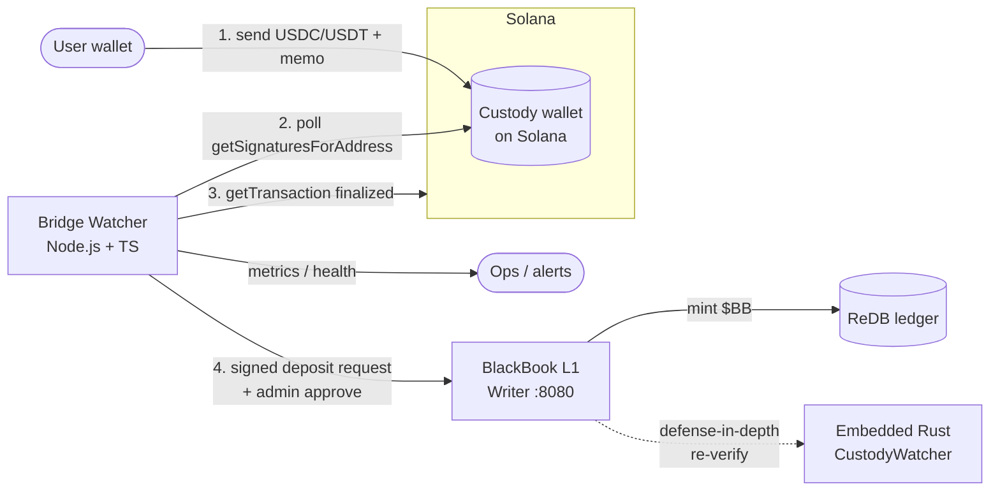
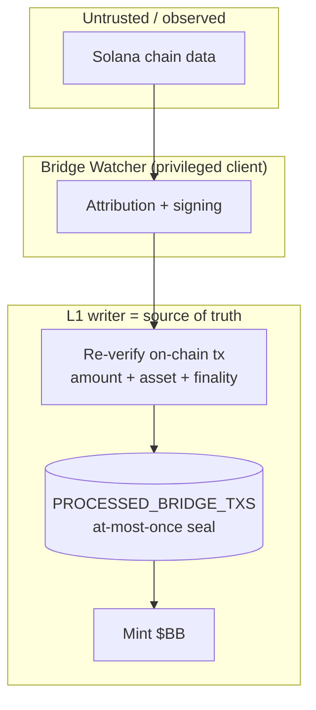

# 01 — Architecture

## 1. System context

The watcher sits **between Solana and the L1 writer**. It holds no funds and is
not part of consensus. It is a *privileged client* that the L1 trust boundary
validates on every call.

---

## 2. Components

| Component | Responsibility | Lives in |
|---|---|---|
| **Cursor store** | Durable checkpoint of the last Solana signature processed | Local SQLite (`bridge.db`) |
| **Solana poller** | `getSignaturesForAddress` paginated scan from the cursor | TS module `solana/poller.ts` |
| **Finality gate** | Only act on `finalized` transactions; enforce confirmation depth | `solana/finality.ts` |
| **Transfer parser** | Decode SPL token transfers + memo from a transaction | `solana/parse.ts` |
| **Attribution** | Map deposit → BB wallet via memo (and amount/asset) | `attribution.ts` |
| **L1 client** | Build canonical messages, sign, call deposit endpoints | `l1/client.ts` |
| **Idempotency store** | Local record of every processed `tx_hash` (mirror of L1 seal) | SQLite table `processed_txs` |
| **Reconciler** | Periodic sweep: re-drive any deposit stuck < finalized or un-acked | `reconciler.ts` |
| **Health/metrics** | `/health`, `/metrics`, structured logs | `server.ts` |

---

## 3. Why externalize? 

L1 already has an embedded `CustodyWatcher` (`src/watcher/mod.rs`) that polls
Solana and calls `verify_and_approve`. We are **not deleting it** — we are
changing which process *drives* the onramp, for four reasons:

1. **Writer isolation.** The L1 writer runs PoH, Sealevel, the gRPC relay, and
   the HTTP API. Coupling it to third-party Solana RPC latency/outages adds a
   failure mode to the most critical node. An external watcher absorbs RPC
   flakiness without touching the writer.

2. **Independent lifecycle.** Bridge logic changes often (new assets, new RPC
   providers, tuned tolerances). Iterating a TS service is a redeploy of a leaf
   service, not a rebuild + restart of the settlement layer.

3. **Better deposit UX.** The current embedded model requires the user to call
   `POST /deposit/request` with their *own* `external_tx_hash` **before** the
   watcher will verify it. The external watcher flips this to **push/memo**
   attribution: the user just sends funds with a memo, and the watcher
   originates the signed request on their behalf (see
   [02-deposit-lifecycle.md](02-deposit-lifecycle.md)).

4. **Topology alignment.** Our scaling plan keeps the writer lean and pushes
   side-work to satellite services. The Bridge Watcher is exactly such a
   satellite, and slots into the existing `sequencer/` monorepo next to L2/L3/L5.

> **Coexistence rule:** The embedded Rust watcher stays enabled as a *backstop*.
> Both paths converge on the same L1 endpoints, and the L1
> `PROCESSED_BRIDGE_TXS` seal guarantees **at-most-once** mint regardless of how
> many drivers race. See [05-security-model.md](05-security-model.md#defense-in-depth).

---

## 4. Trust boundary

The watcher's claims are **never trusted blindly**. The L1 deposit gateway
re-verifies the on-chain transaction (amount, asset, finality) and enforces the
permanent double-mint seal. If the watcher is buggy or compromised, the worst it
can do is submit requests the L1 will *reject*. It cannot forge a mint.

---

## 5. Where it runs

- **Repo location:** new workspace `sequencer/bridge-watcher/` (sibling of
  `sequencer/l2`, `l3`, `l5`, `shared`). Reuses the existing npm workspace,
  TypeScript config, and `@bb/shared` utilities.
- **Process:** single long-lived Node process. Stateless except for its local
  SQLite cursor/idempotency DB (which is fully reconstructable from L1 + chain).
- **Deployment target:** **local / staging only** for now. It points at a
  configurable L1 URL and Solana RPC. It must **never** be pointed at production
  custody without an explicit, separate review (see
  [06-config-and-runbook.md](06-config-and-runbook.md)).

---

## 6. Data ownership

| Data | Authoritative owner | Watcher's copy |
|---|---|---|
| BB balances / mints | **L1 ReDB** | none |
| `processed` tx seal | **L1 `PROCESSED_BRIDGE_TXS`** | local mirror (advisory only) |
| Last scanned signature (cursor) | **Watcher SQLite** | — |
| Exchange rate `BB_USDT` | **L1 `SWAP_RATES`** | none (L1 applies it) |
| Custody wallet address | config (env) | reads it, never controls keys |

The only state the watcher *owns* is its scan cursor — and even that is
recoverable by rescanning the custody wallet's history.
