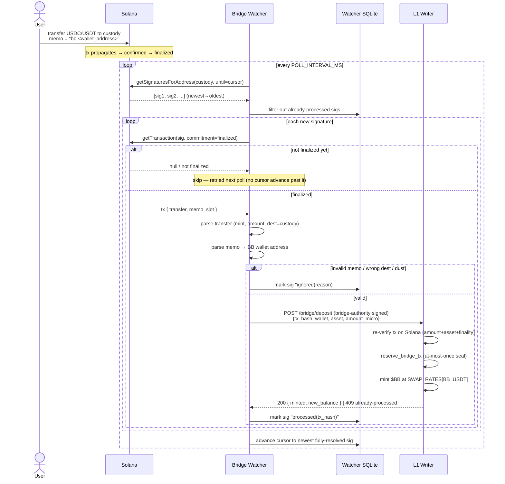
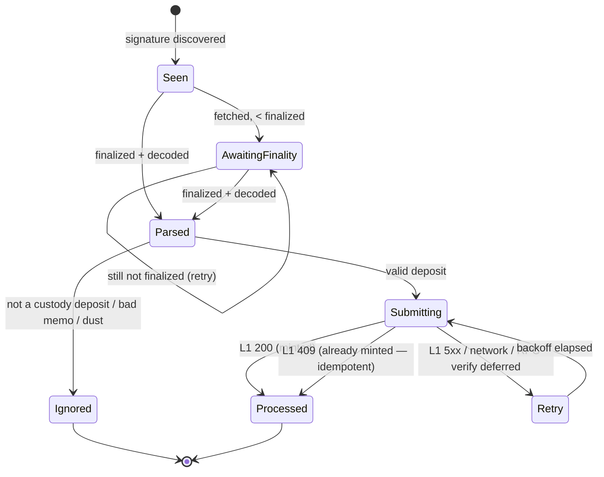

# 02 — Deposit Lifecycle

This document is the **"what happens, in what order"** reference. It covers the
happy path, every state transition, and the timing of each step.

---

## 1. The two attribution models

The L1 deposit gateway is already built around a `external_tx_hash` keyed
record. There are two ways a deposit gets attributed to a BB wallet:

### Model A — Memo attribution (primary, best UX)

The user includes a **memo** on their Solana transfer that contains their BB
wallet address. The watcher reads the memo, builds and **signs the deposit
request on the user's behalf is NOT possible** (the watcher does not hold the
user's key). Instead, the watcher uses the **admin approve** path: it confirms
the on-chain transfer and calls the privileged approve endpoint that mints to
the memo-referenced wallet.

> ⚠️ Key subtlety: `POST /deposit/request` is **user-signed** (Ed25519 over the
> deposit message). The watcher cannot produce that signature. So for memo-based
> deposits the watcher acts as the **dealer/relayer** and drives the
> **admin approve** flow, which is gated by `unsafe_admin` today and must be
> replaced by a dedicated **bridge-authority signature** before any real funds
> (see [03-l1-api-contract.md](03-l1-api-contract.md#bridge-authority) and
> [05-security-model.md](05-security-model.md#key-handling)).

### Model B — User-originated request (existing flow, preserved)

The user (via the wallet UI) calls `POST /deposit/request` themselves, signing
the canonical message with their own key, and passing the `external_tx_hash`.
The watcher's role here shrinks to **driving finalization**: it ensures the
referenced tx reaches `finalized` and that L1 verifies + approves it (the
embedded Rust watcher already does this; the TS watcher is the resilient driver).

> **Design decision:** Build **Model B first** (it reuses the fully-built,
> user-signed, double-mint-protected path with zero new trust assumptions), then
> layer **Model A** behind the bridge-authority key once that key mechanism is
> reviewed. This is reflected in the milestones in
> [07-implementation-plan.md](07-implementation-plan.md).

---

## 2. End-to-end sequence (Model A, target state)

---

## 3. Deposit state machine

Each observed signature moves through these states in the watcher's local DB.
**L1 remains the source of truth for the mint itself** — these states are the
watcher's operational view.

| State | Meaning | Cursor may advance past it? |
|---|---|---|
| `Seen` | Signature discovered, not yet fetched | No |
| `AwaitingFinality` | Fetched but `< finalized` confirmations | **No** (must not skip) |
| `Parsed` | Finalized + decoded transfer/memo | No |
| `Ignored` | Not a valid custody deposit (logged with reason) | Yes |
| `Submitting` | Request in flight to L1 | No |
| `Processed` | L1 minted (or confirmed already-minted) | Yes |
| `Retry` | Transient failure; scheduled for backoff | No |

> **Invariant:** the durable cursor only advances past signatures in a
> **terminal** state (`Ignored` or `Processed`). Anything still in flight forces
> a re-scan on restart. This is what makes the watcher crash-safe.

---

## 4. Timing & "when"

| Event | Timing |
|---|---|
| Poll interval | `POLL_INTERVAL_MS` (default **3000 ms**) |
| Finality wait | Until Solana reports `finalized` (~**12.8 s** / 32 slots typical) |
| L1 submit | Immediately on `Parsed` + valid |
| Retry backoff | Exponential: 2s → 4s → 8s … capped at `MAX_BACKOFF_MS` (default 60s) |
| Reconciler sweep | Every `RECONCILE_INTERVAL_MS` (default **30 s**) re-drives stuck items |
| Cursor checkpoint | After every poll cycle that reaches a terminal state |

The watcher is **eventually consistent**: a deposit is guaranteed to be minted
within roughly `finality + one poll cycle`, and is *retried indefinitely* until
L1 confirms processing. There is no time window in which a valid deposit is
silently dropped.

---

## 5. Failure scenarios (and the resulting behavior)

| Failure | Behavior | Net effect |
|---|---|---|
| Watcher crashes mid-submit | On restart, signature is still `Submitting`/`Seen` → re-scanned → re-submitted; L1 seal makes the retry a 409 no-op if it already minted | At-most-once mint preserved |
| Solana RPC down | Poll fails, cursor unchanged, retried next interval | No data loss |
| L1 writer down | Submit fails → `Retry` with backoff; reconciler keeps trying | Deposit mints once L1 returns |
| Solana reorg before finality | Tx never reaches `finalized` → never submitted | No phantom mint |
| Duplicate memo / two deposits same wallet | Each has a **distinct `tx_hash`** → two independent mints (correct) | Correct |
| Replayed/forged submit to L1 | L1 re-verifies on-chain + seal rejects | Rejected at trust boundary |
| Memo missing/garbled | `Ignored(bad_memo)`, surfaced to ops for manual attribution | No incorrect mint |
