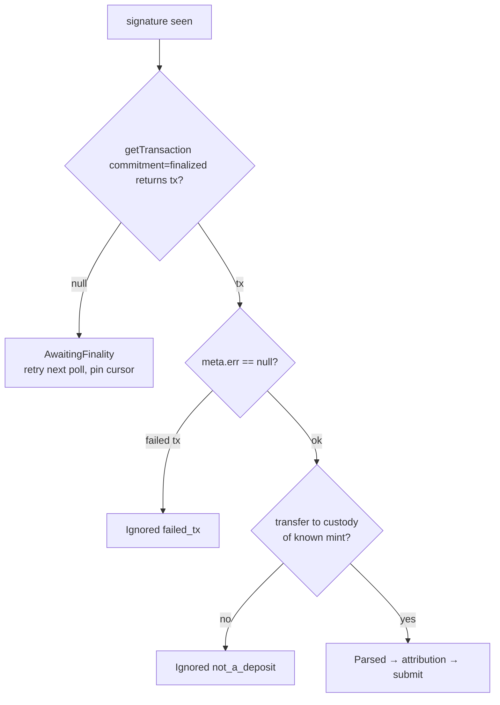

# 04 — Solana Watcher Internals

How the watcher actually reads Solana: RPC calls, finality, cursoring, transfer
parsing, and memo attribution. This mirrors the proven logic in the embedded
Rust `CustodyWatcher` (`src/watcher/mod.rs`) so the two stay behaviorally
consistent.

---

## 1. RPC methods used

| Method | Purpose | Commitment |
|---|---|---|
| `getSignaturesForAddress(custody, {until, limit})` | Discover new txs touching custody | `confirmed` (discovery) |
| `getTransaction(sig, {maxSupportedTransactionVersion:0, commitment})` | Fetch + verify a tx | **`finalized`** (action) |
| `getHealth` | RPC liveness for `/health` | — |

> Two-phase commitment: **discover** at `confirmed` (fast, catches candidates),
> but only **act** at `finalized` (irreversible). A tx seen at `confirmed` but
> not yet `finalized` stays in `AwaitingFinality` and is retried — never minted.

---

## 2. Cursor & pagination

`getSignaturesForAddress` returns signatures **newest → oldest**. The watcher
keeps a durable `cursor = last fully-resolved signature` and passes it as
`until` so each poll only returns work newer than the cursor.

```
poll():
  sigs = getSignaturesForAddress(custody, until=cursor, limit=100)
  # sigs are newest→oldest; process oldest→newest so cursor advances monotonically
  for sig in reverse(sigs):
      handle(sig)        # may end terminal (Processed/Ignored) or non-terminal
  cursor = newest signature whose entire older history is terminal
```

**Cursor advance rule (critical):** the cursor may only move past a signature
once that signature **and every older unprocessed signature** is in a terminal
state. A single `AwaitingFinality`/`Retry` item pins the cursor behind it so a
crash never skips it. (Implementation: store per-sig state in SQLite; cursor =
newest sig with no non-terminal predecessor.)

### Cold start / backfill

On first run (no cursor) or after long downtime, the watcher paginates backward
through history until it reaches either a configured `BRIDGE_GENESIS_SIGNATURE`
or a signature already marked `Processed` in local DB. This bounds the backfill
and makes restarts safe and idempotent.

---

## 3. Transfer parsing

For each finalized `getTransaction` result, extract token transfers from
`meta.preTokenBalances` / `meta.postTokenBalances` (robust across transfer,
transferChecked, and routed transfers), filtering to:

- **destination owner == custody wallet**, and
- **mint ∈ { configured USDC mint, configured USDT mint }**.

The credited amount = `postBalance(custody) − preBalance(custody)` for that mint
(in micro units, u64). Asset = whichever configured mint matched.

> Using pre/post balances (not raw instruction decoding) matches the embedded
> watcher and is resilient to aggregator/router instructions, multiple inner
> transfers, and fee accounts.

Well-known Solana **mainnet** mints (from `src/watcher/mod.rs`):

```
USDC: EPjFWdd5AufqSSqeM2qN1xzybapC8G4wEGGkZwyTDt1v
USDT: Es9vMFrzaCERmJfrF4H2FYD4KCoNkY11McCe8BenwNYB
```

Both are **overridable via env** (`USDC_MINT` / `USDT_MINT`) for devnet/staging.

---

## 4. Memo attribution (Model A)

The BB destination wallet is carried in a **Memo program instruction** on the
deposit transaction. Canonical memo format:

```
bb:<base58_bb_wallet_address>
```

Parsing rules:

1. Find the SPL Memo program instruction(s) (`MemoSq4gqABAXKb96qnH8TysNcWxMyWCqXgDLGmfcHr`).
2. Trim; require the `bb:` prefix; take the remainder as the candidate address.
3. Validate with the **same** rule L1 uses (`is_valid_bb_address`): base58,
   Solana-style, **reject `0x` EVM addresses**.
4. If absent/invalid → state `Ignored(bad_memo)` and surface to ops for manual
   handling (do **not** guess an address).

> The watcher passes the memo-derived wallet to L1, but L1 still independently
> re-verifies the transfer's amount/asset/finality. The memo only decides *who*
> gets credited; it can never inflate *how much*.

---

## 5. Finality gate details



- A **failed** transaction (`meta.err != null`) is `Ignored` — no funds moved.
- "Finalized" is taken from the RPC commitment, not a manual slot-depth count;
  this matches `commitment: "finalized"` already used by the Rust verifier.
- An optional extra `MIN_CONFIRMATION_SLOTS` guard can require `tipSlot − txSlot ≥ N`
  on top of `finalized` for defense in depth (default 0 = rely on `finalized`).

---

## 6. Amount tolerance

L1's verifier already enforces an amount match within **1% or $0.01, whichever
is larger** (`verify_and_approve` in `src/watcher/mod.rs`). The TS watcher does
**not** need its own tolerance for Model A (it reports the *actual on-chain*
amount, so there's nothing to reconcile). The tolerance exists for Model B where
the *user-claimed* amount may differ slightly from the on-chain amount.

> Rule: **always submit the amount the chain shows**, never a user-claimed
> amount. This makes the L1 tolerance check a formality rather than a dependency.

---

## 7. RPC provider strategy

- Single primary `SOLANA_RPC_URL`, with an optional comma-separated
  `SOLANA_RPC_FALLBACKS` list. On 429/5xx/timeout, rotate to the next provider
  for that call; never advance the cursor on RPC failure.
- Connection-pooled HTTP client (keep-alive), bounded concurrency
  (`MAX_INFLIGHT_RPC`, default 4) so a backlog can't hammer a rate-limited RPC.
- All RPC calls have a hard timeout (`RPC_TIMEOUT_MS`, default 10s) and jittered
  exponential retry.
